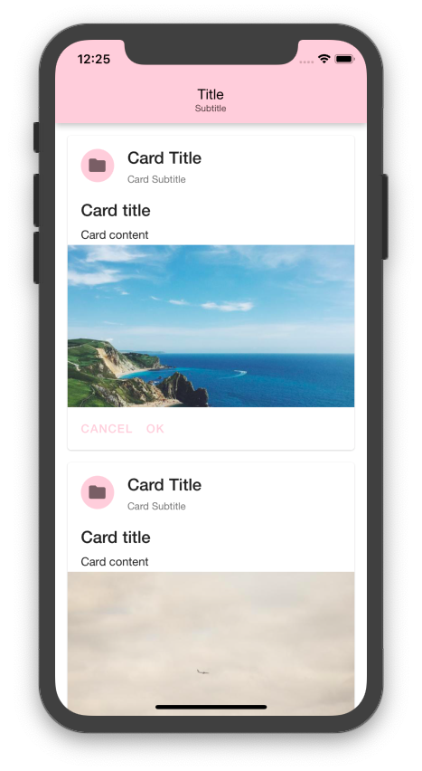
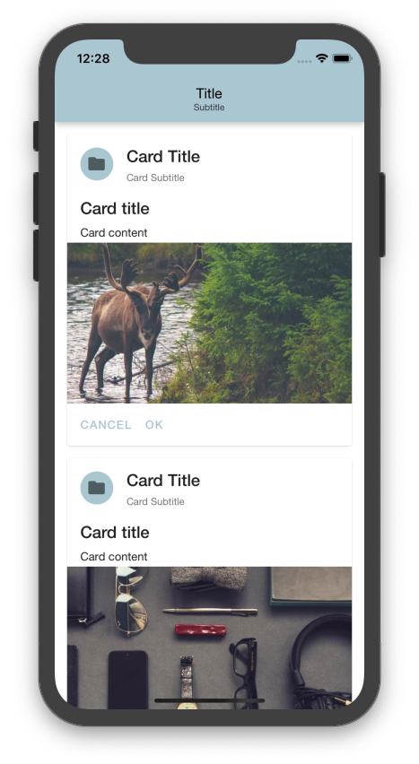
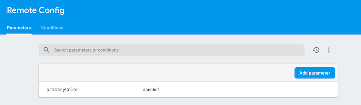

# try-react-native-firebase

[](https://github.com/prettier/prettier)

## 📚 Learn Firebase with React-Naitve.

### Configure theme using remote config.





## 🚀 Installation

```
yarn
cd ios
pod install
cd ..
react-native run-ios
```

## 📝 References

- [react-native-firebase](https://github.com/invertase/react-native-firebase)
- [react-native-paper](https://github.com/callstack/react-native-paper)

## 🚧 Todo

- [x] Setup react-native-firebase on iOS.
- [ ] Setup react-native-firebase on Android.
